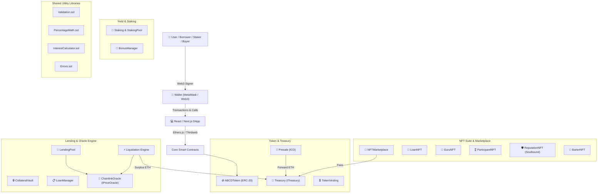
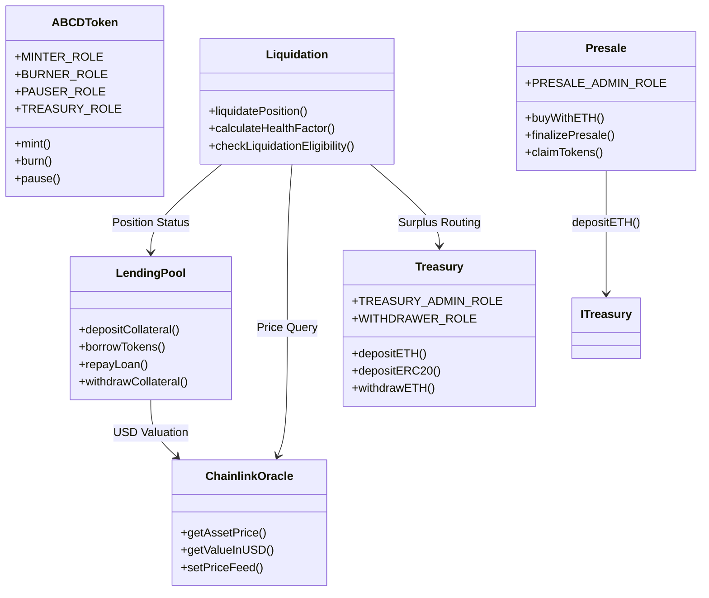
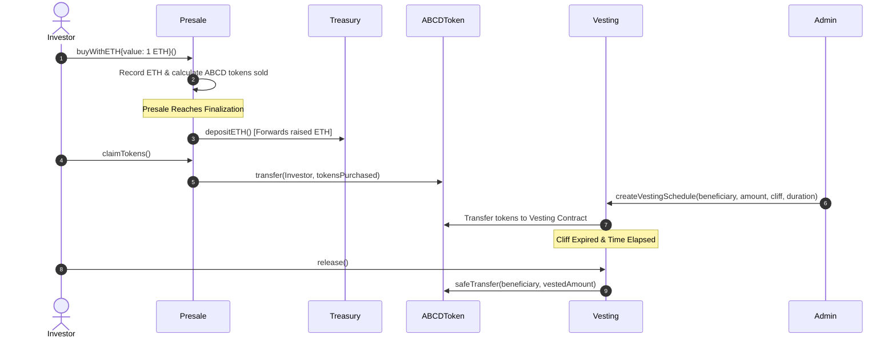
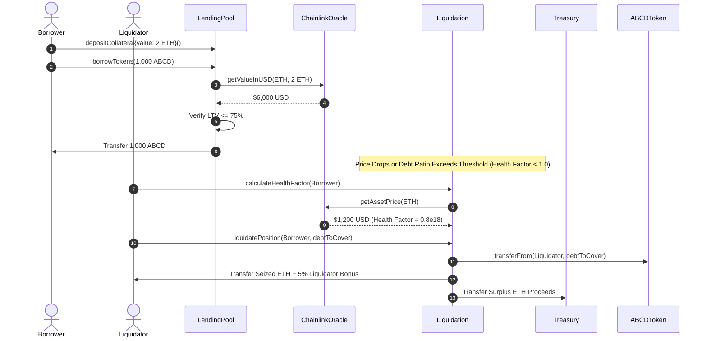
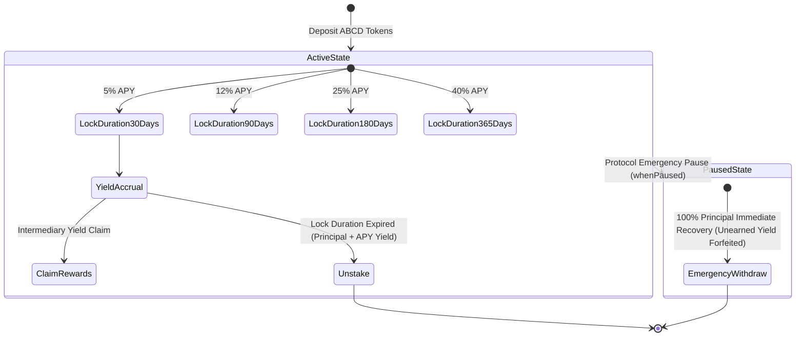
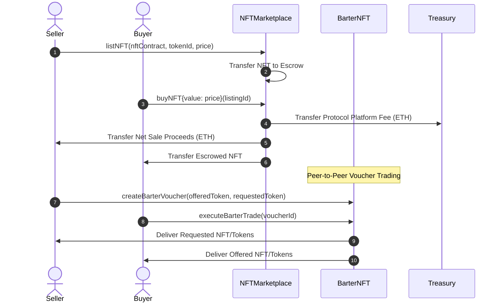

# ABCDeFi Protocol — Comprehensive System Architecture

The **ABCDeFi Protocol** is an enterprise-grade decentralized finance (DeFi) ecosystem integrating an ERC-20 utility token (`ABCDToken`), ICO Presale engine, multi-tier Staking pools, Collateralized Lending & Liquidation, Token Vesting schedules, Chainlink Oracles, and a peer-to-peer NFT Marketplace.

---

## 1. System High-Level Topology

---

## 2. Smart Contract Relationships & Access Control

---

## 3. Token Flow & Distribution Model

---

## 4. Lending, Dynamic Interest & Liquidation Flow

---

## 5. Staking & Emergency Withdraw Flow

---

## 6. NFT Suite & Peer-to-Peer Marketplace Flow

---

## 7. Shared Libraries & Utility Layer

| Library Name | Primary Responsibility | Key Functions |
| :--- | :--- | :--- |
| **`Validation.sol`** | Centralized input & boundary checks | `validateAddress()`, `validateAmount()`, `validatePercentage()`, `validateDeadline()` |
| **`PercentageMath.sol`** | Precision 4-decimal basis points math ($10000 = 100\%$) | `percentMul()`, `percentDiv()` with half-up rounding |
| **`InterestCalculator.sol`** | Accrued interest & pool utilization rates | `calculateSimpleInterest()`, `calculateUtilizationRate()`, `calculateVariableBorrowRate()` |
| **`Errors.sol`** | Custom gas-efficient Solidity errors | `ZeroAddress()`, `InvalidAmount()`, `InvalidPercentage()`, `InvalidDeadline()` |
