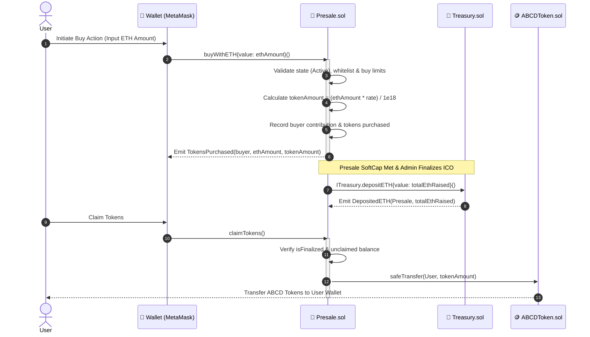
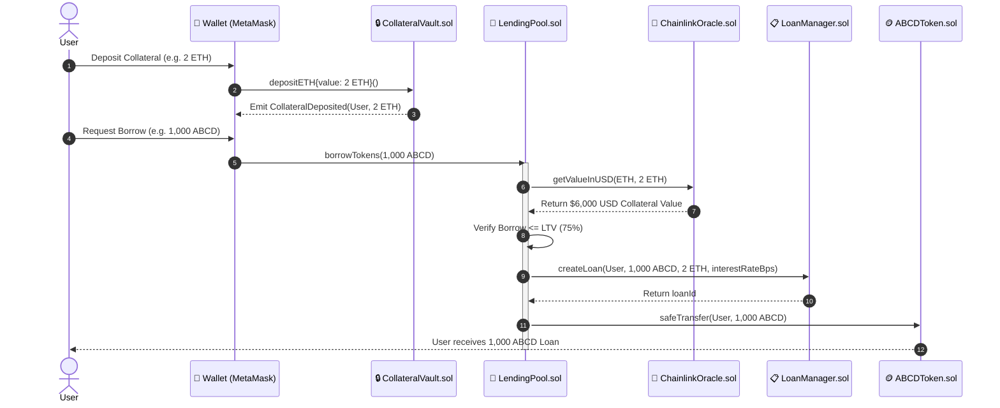
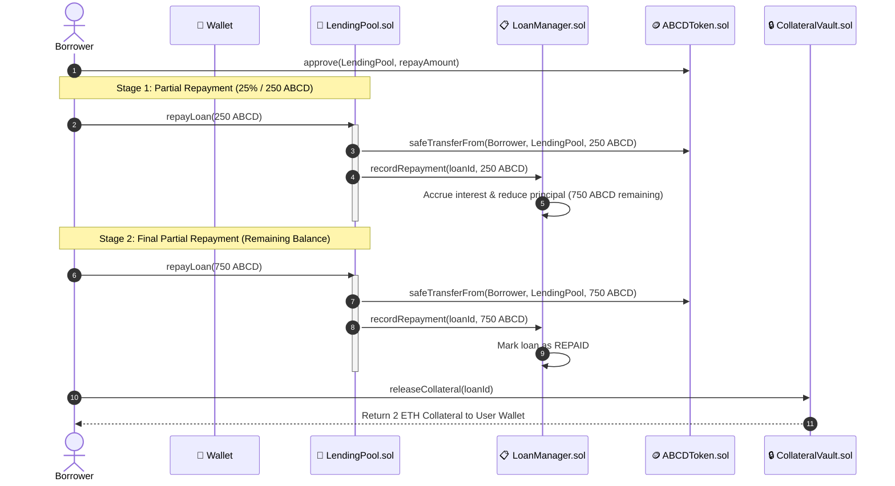
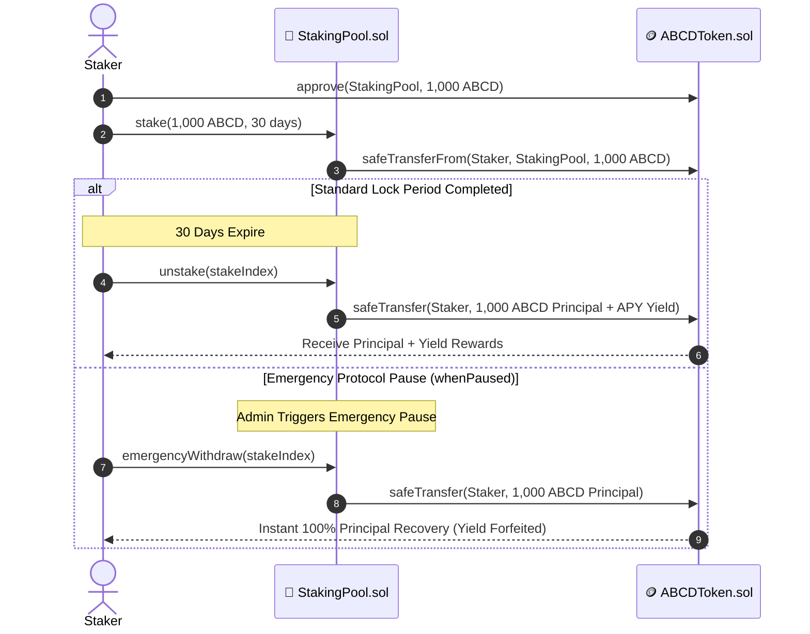
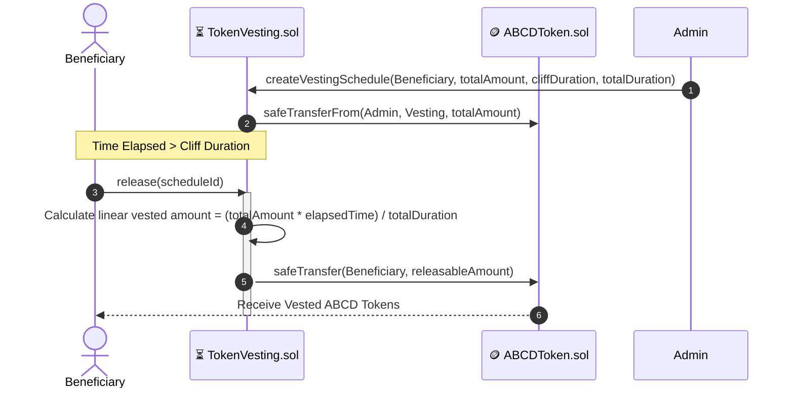
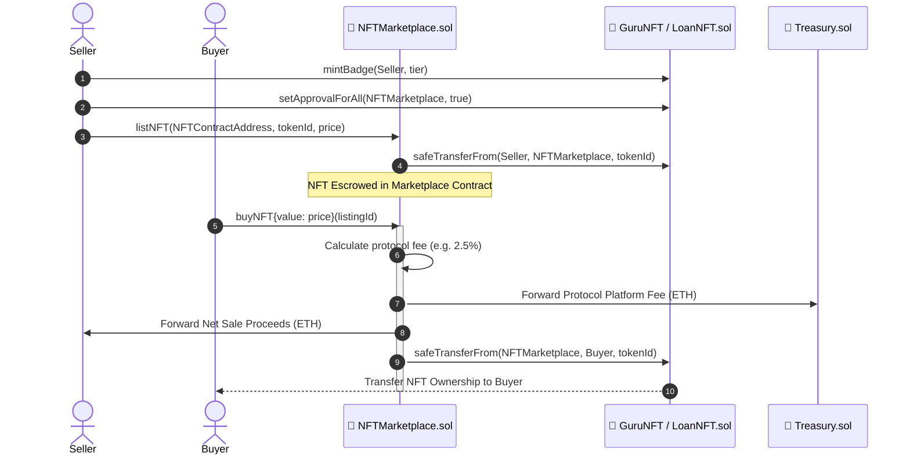

# ABCDeFi Protocol — Comprehensive Sequence Diagrams

This document contains detailed end-to-end execution sequence diagrams for all core user flows in the **ABCDeFi Protocol**.

---

## 1. Buy Tokens Sequence (ICO Presale)

---

## 2. Borrow Loan Sequence (Collateralized Lending)

---

## 3. Repay Loan & Partial Repayment Sequence

---

## 4. Staking & Emergency Withdraw Sequence

---

## 5. Token Vesting Claim Sequence

---

## 6. NFT Minting & Marketplace Listing Sequence

